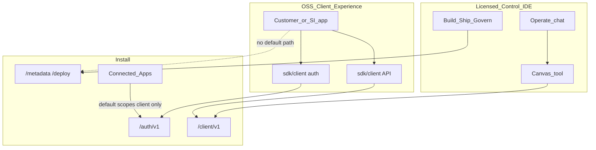

# Client Experience + OSS client kits — build plan

Executable plan for customer-hosted **Client Experiences**: open-source auth and Client API kits under `sdk/client/`, Connected Apps with Client-only defaults, and Deploy-promoted Experience config — without reopening Control IDE as a plugin host or replacing CRM Canvas.

**ADR:** [ADR-019](../adr/019-client-experience-oss-kits.md)  
**Backlog:** [BP-040](../../backlog/BP-040-client-experience-oss-kits.md)  
**Parents:** [customer-connect.md](../customer-connect.md) · [monorepo.md](../monorepo.md) · [security.md](../security.md)

---

## Thesis

> **Canvas scales Operate working sets; Client Experience scales customer end-user apps; OSS kits are the encouraged path; AuthZ and scope defaults are the trust root.**

CRM Canvas ([ADR-018](../adr/018-crm-canvas-document.md)) remains an Operate tool inside optional Control IDE. Browser list views, portals, and integration UIs are **Client Experiences** built with OSS kits, registered as Connected Apps, and hosted on customer infra.

---

## Architecture

---

## Locked product decisions

| Topic | Choice |
|---|---|
| Canvas role | Operate tool only ([ADR-018](../adr/018-crm-canvas-document.md)); not sole client UX |
| End-user browser apps | Client Experience track ([ADR-019](../adr/019-client-experience-oss-kits.md)) |
| OSS kit location | `sdk/client/` (Apache-2.0; not in product image) |
| Experience API fence | `/auth/v1` + `/client/v1` only by default |
| Connected App scopes | `client` for public/browser; Metadata/Deploy for confidential admin clients |
| Experience code hosting | Customer infra + customer CI; Majesta One promotes config via Deploy |
| Control IDE | Licensed; only supported Deploy/Metadata authoring surface |
| Telephony / vendor SDKs | UI in Experience; server I/O via connectors ([BP-014](../../backlog/BP-014-agent-outbound-integrations.md)) |

---

## Secure-by-default rules (standing)

1. Register a Connected App with **PKCE**; strict redirect URI allowlist; no long-lived client secrets in SPAs.
2. Request **`client` scope only** for Experience apps; Metadata/Deploy in a browser app is unsupported and a security smell.
3. Call `/client/v1` under a **user JWT** (or short-lived exchanged token); never embed break-glass `API_KEYS` in client bundles.
4. Host the Experience on **customer infra**; promote **config** (Connected App + Experience metadata) via Deploy; promote **code** via customer CI.
5. Third-party SDKs (telephony, maps): vendor UI in the Experience; secrets and REST via install connectors + egress allowlist.
6. Control IDE remains the supported surface for Build/Ship/Govern; admin-IDE forks are best-effort unsupported.

---

## Phases

### Phase 0 — ADR + doc frame (this change)

| Deliverable | Status |
|---|---|
| [ADR-019](../adr/019-client-experience-oss-kits.md) | Done |
| [BP-040](../../backlog/BP-040-client-experience-oss-kits.md) | Done |
| Amend ADR-012/018, customer-connect, IDE/Canvas docs, indexes | Done |
| Cross-links from [sdk/README.md](../../sdk/README.md) | Done |

### Phase 1 — Security guide

| Deliverable | Status |
|---|---|
| [client-experience-security.md](../client-experience-security.md) | Done |

### Phase 2 — Scaffold `sdk/client/`

| Deliverable | Status |
|---|---|
| [`sdk/client/auth`](../../sdk/client/auth/) (`@one/auth`) | Done |
| [`sdk/client/client`](../../sdk/client/client/) (`@one/client`) | Done |
| [`sdk/client/README.md`](../../sdk/client/README.md) | Done |
| `@one/react` hooks | Deferred |

### Phase 3 — Platform Connected App defaults

| Deliverable | Status |
|---|---|
| Public clients default `client` scope + `StandardUser` role | Done (`internal/integration/scopes.go`) |
| Reject Metadata/Deploy/Ops on public `allowedScopesHint` | Done |

### Phase 4 — Experience package metadata

| Deliverable | Status |
|---|---|
| `migrations/0041_metadata_experiences.sql` | Done |
| Pack/validate/apply (`metadata/experiences/*.yaml`) | Done |
| `GET /metadata/v1/experiences` | Done |
| Control IDE Govern Experiences list | Done |

### Phase 5 — Reference Experience sample

| Deliverable | Status |
|---|---|
| [`sdk/client/examples/list-view/`](../../sdk/client/examples/list-view/) | Done |

### Phase 6 — Connector + Experience pairing guide

| Deliverable | Status |
|---|---|
| [client-experience-telephony.md](../client-experience-telephony.md) | Done |
| Partner certification ladder | Deferred |

---

## Explicit non-goals

- OSS Experience as Operate canvas ([ADR-018](../adr/018-crm-canvas-document.md) fence stands)
- Customer Electron plugins ([ADR-012](../adr/012-customer-repo-and-control-ide.md))
- Product `/x` host or webpack customer UI into Go image
- npm inside Deno guest ([ADR-014](../adr/014-customer-code-automations.md))

---

## Success criteria

| Phase | Done when |
|---|---|
| 0 | Reader can distinguish Canvas vs Experience; ADR-019 indexed |
| 1 | Security guide published; kits reference it |
| 2 | `sdk/client/` scaffold merged; monorepo boundary documented |
| 3 | Public Connected Apps cannot mint Metadata/Deploy by default |
| 4 | Experience YAML pack/promote works; Govern lists registered apps |
| 5 | Sample list-view runs against local install with PKCE |
| 6 | Telephony pairing doc landed; connector path clear |

---

## Related

- [ADR-018](../adr/018-crm-canvas-document.md) · [BP-039](../adr/018-crm-canvas-document.md)
- [outbound-otel-build-plan.md](./outbound-otel-build-plan.md) · [BP-014](../../backlog/BP-014-agent-outbound-integrations.md)
- [idp-agnostic-login-build-plan.md](./idp-agnostic-login-build-plan.md) · [BP-013](../../backlog/BP-013-jwt-unified-principals.md)
