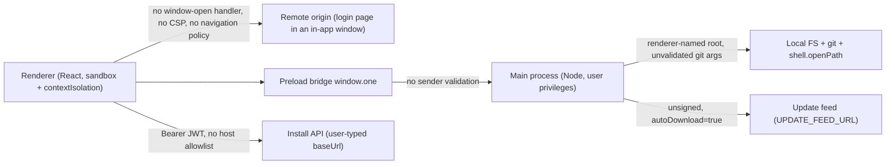

# Control IDE security audit and remediation

**Playbook:** [agent-control-ide.md](./agent-control-ide.md) · **ADR:** [012](../adr/012-customer-repo-and-control-ide.md), [015](../adr/015-idp-agnostic-social-login.md) · **Backlog:** [BP-015](../adr/030-install-agent-runtime.md), [BP-022](../../backlog/BP-022-client-access-ide-device.md), [BP-023](../../backlog/BP-048-one-cli.md), [BP-026](../../backlog/BP-026-oss-security-public-backlog.md) · **Domain agent:** `control-ide`

## Thesis

Control IDE is a desktop client that holds a Majesta One JWT, a privileged preload bridge over the local filesystem and `git`, and an auto-update channel. Its renderer displays content from three sources the operator does not control: the install API, the customer repo, and agent output. The audit treats **hostile install API**, **hostile local process**, **hostile customer repo content**, and **renderer content compromise** as in-scope adversaries, and asks what each can reach.

The dangerous property is not any single bug; it is that the privileged bridge was reachable by anything Electron chose to load, and the main process trusted every argument the renderer sent it.

## Scope

In scope: `tools/control-ide/**`, `electron-builder.yml`, the `control-ide` CI job, `scripts/assert-ide-artifacts.sh`, and the npm dependency tree.

Out of scope: the Go product plane (`cmd/`, `internal/`, `migrations/`, `deploy/`) per the scope fence in [AGENTS.md](../../AGENTS.md); code signing and notarization, which need credentials and stay on [BP-015](../adr/030-install-agent-runtime.md); penetration testing of the install API.

## Method

- Manual read of the entire main and preload surface (`src/main/main.ts`, `src/preload/preload.ts`, `src/main/paths.ts`, `src/main/updates.ts`).
- Renderer sweep for untrusted-content rendering, token flow, preload call sites, and outbound network use.
- Build, CI, and packaging review.
- Lockfile scan of all resolved packages against the OSV API, cross-checked with `npm audit`.
- Exploit primitives reproduced rather than assumed. `git clone --upload-pack=<cmd>` does execute the payload (git 2.39.5); the `ext::` transport is already blocked by git defaults; and the assumed preload inheritance in renderer-created windows does **not** happen under `sandbox: true` (see the CIDE-01 correction). Reading the code is how findings are found; running them is how severities get set.
- `npm run smoke:electron` drives the real Electron binary over the DevTools protocol and asserts each boundary control from outside the app, so the guards are proven in the shipped shell rather than only in unit tests.

## Trust boundaries before remediation

## Findings register

Each finding records the sink, the reachable adversary, and the control that closes it. Status is maintained as remediation lands.

### Critical

**CIDE-02 — Electron 34.5.8 was a year past end of life.** *Fixed (Phase 3).*
Electron 34 went EOL 2025-06-24 and receives no security releases. OSV reported 18 Electron advisories against 34.5.8, including ASAR integrity bypass (`GHSA-vmqv-hx8q-j7mg`), renderer command-line switch injection (`GHSA-9wfr-w7mm-pc7f`), and several use-after-free issues; underneath sat an unpatched Chromium M132. Because `electron` is a `devDependency`, `npm audit` framed the shipped runtime as a dev-only problem. Control: Electron 43.2.x (supported major) with `electronFuses` in `electron-builder.yml` via `@electron/fuses` (`runAsNode`, `NODE_OPTIONS`, inspect args off; cookie encryption, ASAR integrity validation, and `onlyLoadAppFromAsar` on).

### High

**CIDE-01 — Unrestricted renderer-initiated window creation.** *Fixed (Phase 1). Severity revised down from Critical — see the correction below.*
`ConnectSection` opened the Majesta One login URL with `window.open`, and the main process installed no `setWindowOpenHandler`. Consequences that stand:

- The OAuth login page rendered **inside the app chrome**, with no address bar. The operator could not inspect the URL or the TLS certificate before typing IdP credentials — in a flow whose entire premise (ADR-015) is that the human authenticates in a browser they can trust. A hostile or mistyped `baseUrl` turns that window into a convincing credential-harvesting page.
- The child window was created with no CSP, no navigation policy, and no `will-navigate` guard, so a remote page could navigate freely inside the app. `noopener` was passed at this one call site but nothing enforced it as policy.
- Electron 34 additionally carries `GHSA-f3pv-wv63-48x8`, where named `window.open` targets are not scoped to the opener's browsing context.
- It defeats the `one-control://` deep-link design that the rest of the PKCE flow depends on ([BP-022](../../backlog/BP-022-client-access-ide-device.md)).

**Correction from testing.** The finding was first written up as Critical on the premise — stated in Electron's own `window.open` documentation — that renderer-created windows inherit the parent's security-related `webPreferences` including `preload`, which would have handed a remote page the full `window.one` bridge. That was tested directly against Electron 34.5.8 with `sandbox: true` by removing the guard and driving the app over the DevTools protocol. In all three cases — a cross-origin `http://` page, `about:blank`, and the app's own `file://` document — the child window reported `typeof window.one === "undefined"`. **The preload is not injected into renderer-created windows in this configuration, so there was no filesystem or `git` escalation.** The severity is therefore High (phishing surface and unbounded in-app navigation), not Critical. The fix is unchanged: deny every renderer-initiated window and route vetted `https` or loopback URLs through `shell.openExternal`, which also puts the login page in the OS browser where it belongs.

**CIDE-03 — No Content-Security-Policy.** *Fixed (Phase 1).*
Neither `index.html` nor the main process set a policy, so nothing constrained `script-src`, `connect-src`, or `frame-src` in a window holding a privileged bridge. Control: a policy applied through `onHeadersReceived` plus a matching meta tag, with `connect-src` widened only to the configured install origins.

**CIDE-04 — Filesystem IPC was confined relative to a renderer-chosen root.** *Fixed (Phase 1).*
`resolveUnderRoot` correctly blocked `..` escapes, but the `root` it resolved against arrived from the renderer, so `root: "/"` reached any file the user could. Control: the main process owns the repo root; `fs:*` handlers take a relative path only.

**CIDE-05 — `git clone` argument injection.** *Fixed (Phase 1).*
`execFile("git", ["clone", url, destPath])` ran with no validation of `url`. A value starting with `--upload-pack=` is parsed as an option and its payload executed — reproduced locally on git 2.39.5. The `url` originates from `session.customerRepoUrl`, populated from `/deploy/v1/environment`, so a hostile API response reaches the sink. Control: reject any argument beginning with `-`, allowlist clone URL schemes, and pin transport-related git config per invocation.

**CIDE-06 — No IPC sender validation, no navigation guard.** *Fixed (Phase 1).*
No handler checked `event.senderFrame`, and there was no `will-navigate`, `will-attach-webview`, or permission handler. Any frame that got into the app reached every handler. Control: an allowlist of trusted frame URLs checked in every handler, navigation confined to the app origin, webviews refused, and permissions denied by default.

**CIDE-07 — Unauthenticated update channel.** *Partially fixed (Phase 2); signing remains on BP-015.*
`UPDATE_FEED_URL` was trimmed but otherwise unvalidated (any scheme, any host) and `autoDownload` was `true`, against a `generic` provider with unsigned artifacts and no ASAR integrity. Control now: `validateFeedUrl` requires `https`, no embedded credentials, and a host in `UPDATE_FEED_HOST_ALLOWLIST`; `autoDownload` is off and download only runs on an explicit Check. Signing and notarization stay on BP-015.

**CIDE-08 — JWT sent to an unvalidated base URL.** *Fixed (Phase 2).*
`apiFetch` concatenated any `baseUrl` and attached `Authorization: Bearer`; plain `http://` was accepted, and peer `baseUrl` values from the Deploy API were offered as a one-click Connect, so a hostile peer record could steer the token to an attacker host. Control: `assertApiBaseUrl` / `checkInstallBaseUrl` require `https` off-loopback (plaintext needs an explicit ack), reject embedded credentials, and Connect blocks peer-prefilled hosts until the operator clicks "I trust this host".

**CIDE-09 — electron-builder 25.1.8 carried two HIGH advisories.** *Fixed (Phase 3).*
`app-builder-lib@25.1.8` has `GHSA-7g7r-gx96-252g` (uncontrolled search path in built AppImages) and the tree pinned `builder-util-runtime@9.2.10` with `GHSA-p2f4-r6v6-j797` (credentials leaked across origin redirects). Control: electron-builder 26.15+.

### Medium

**CIDE-10 — Silent plaintext token storage.** *Fixed (Phase 2); ephemeral follow-up 2026-07-26; persist follow-up 2026-08-20.*
Session persistence fell back to `Buffer.from(text)` when `safeStorage.isEncryptionAvailable()` was false — common on Linux without a keyring — writing the JWT in cleartext at default file mode with no signal to the operator. Control: never write UTF-8 JSON. Prefer OS `safeStorage`; when the keyring is missing, persist with AES-256-GCM using a per-install `session.key` at mode `0600` so closing the app does not drop the login. Memory-only (`ephemeral: true`) is last resort if even the local key cannot be written. Legacy plaintext is migrated on read. The top-bar chip shows the user’s initials and name, not JWT/ephemeral labels.

**CIDE-11 — OAuth callback trust.** *Fixed (Phase 2).*
The state check was skipped when the callback omitted `state`, and the `one-control://` handler broadcast any argv- or `open-url`-supplied URL to every window, including at cold start, with no check that a flow was pending. Control: `parseOAuthCallbackUrl` requires `state`, pending PKCE is single-use via `takePendingPkce`, and deep links are ignored unless a flow is pending.

**CIDE-12 — `shell.openPath` on a renderer-supplied path.** *Fixed (Phase 1).*
An arbitrary path went to the OS default handler, which launches executables and `.desktop` files. Control: confine to the main-owned repo root and require a directory.

**CIDE-13 — Clone source was API-controlled.** *Fixed (Phase 1).*
Beyond the injection above, no scheme allowlist meant `customerRepoUrl` could name a local path or hostile remote. Control: scheme allowlist plus `protocol.ext.allow=never`, `core.hooksPath=/dev/null`, and `--no-recurse-submodules` on clone.

**CIDE-14 — Vulnerable and deprecated transitive packages, with no gate.** *Fixed (Phase 0 gate, Phase 3 bumps).*
`brace-expansion` DoS at three versions, a critical `tar@6.2.1` advisory cluster, and 14 packages carrying npm deprecation notices, nearly all under electron-builder 25. No `npm audit`, SCA, or Dependabot existed anywhere in `.github/`. Control: `npm audit --audit-level=high` required in CI, Dependabot for npm and gomod, electron-builder 26.15+, and `overrides` pins of `brace-expansion@5.0.8` plus `minimatch@10.2.5` so nested builder/coverage copies clear `GHSA-mh99-v99m-4gvg` without breaking Vitest coverage's CJS import of `brace-expansion`.

**CIDE-15 — No linter, and the trust boundary excluded from coverage.** *Fixed (Phase 0 and Phase 4).*
There was no ESLint config, no `lint` script, and no lint job, though five files carried `eslint-disable` comments. `vitest.config.ts` excluded `src/main/main.ts` and `src/preload/**` from coverage, leaving the entire IPC boundary outside the CI gate. Control: ESLint flat config with `eslint-plugin-security`; CI lint + coverage of `src/main/*` policy modules (`security`, `paths`, `sessionStore`, `updates`, `ipcTrust`, `protocol`, `webContentsPolicy`) and `src/preload/oneApi.ts`; Electron lifecycle wiring in `main.ts` / `preload.ts` exercised by `npm run smoke:electron` in CI.

**CIDE-16 — `@assistant-ui/react` transitive surface.** *Reviewed (Phase 3).*
0.15.x pulls `assistant-cloud`, `assistant-stream`, `safe-content-frame`, the `radix-ui` meta package, `zod`, `zustand`, and `nanoid` into the shipped bundle. Verified: nothing initiates an outbound call without an explicitly configured cloud client; primary and fallback rendering route agent text through React text nodes (`StreamMessageBubble` / plain `
` — no `MessagePrimitive.Parts` markdown path); CSP `connect-src` is the backstop. No `dangerouslySetInnerHTML` exists anywhere in the renderer.

**CIDE-17 — Dev web preview bound every interface.** *Fixed (Phase 1).*
`vite.web.config.ts` set `host: "0.0.0.0"`, serving the full renderer to the LAN during development. Control: bind loopback.

**CIDE-18 — Credential and error hygiene.** *Fixed (Phase 2).*
The JWT was rendered into a plain `textarea`, the PKCE verifier lives in `sessionStorage`, and `apiFetch` echoed full API error bodies into visible UI. `createAgentRun` in the primary chat path omitted `approved: false`, relying on a server default the dock path sets explicitly. Control: JWT is masked until Reveal, `formatError` / `redactSensitive` strip bearer-shaped material from banners, and the primary chat path sets `approved: false` explicitly.

## Controls confirmed already in place

Recorded so remediation does not regress them: `contextIsolation: true`, `nodeIntegration: false`, `sandbox: true`; no `dangerouslySetInnerHTML` or `eval` in the renderer; the JWT never reaches `localStorage` or a query string; the commit path allowlist in `isCommitAllowlisted`; source maps stripped from installers and `assert-ide-artifacts.sh` rejecting `.map`, `.env`, and vendor-plane files; `npm ci` against a fully `integrity`-pinned lockfile sourced only from `registry.npmjs.org`; Gitleaks on every pull request; self-hosted fonts with no CDN dependency.

## Remediation phases

**Phase 0 — audit record and CI gates.** This document, an ESLint flat config with `eslint-plugin-security`, Dependabot for npm and gomod, and lint plus `npm audit --audit-level=high` steps in the `control-ide` CI job.

**Phase 1 — Electron trust boundary.** Window-open denial with `shell.openExternal`, navigation and webview guards, CSP, deny-all permission handler, IPC sender validation, a main-owned repo root for every filesystem and git handler, git argument and URL allowlists, `shell.openPath` confinement, loopback dev binding.

**Phase 2 — auth, session, and update input.** Base URL validation with peer-host confirmation, strict OAuth state and pending-flow checks, fail-closed session encryption at mode `0600`, masked token display, sanitized error surfacing, explicit `approved: false`, and an `https` host allowlist for `UPDATE_FEED_URL` with `autoDownload` disabled.

**Phase 3 — dependencies.** Electron 43 with `@electron/fuses` / `electronFuses`, electron-builder 26.15+, `brace-expansion` + `minimatch` overrides, `docs/tech-stack.md` updated, `@assistant-ui` fallback hardened, OSV/`npm audit --audit-level=high` clean and required in CI.

**Phase 4 — verification.** *Done.* Guard modules extracted and covered by Vitest; coverage gate includes `src/main/**` policy + `src/preload/oneApi.ts`; `smoke:electron` runs under xvfb in the Control IDE CI job; lint / audit / coverage / build / AppImage / artifact assert remain green.

**Phase 5 — backlog alignment.** *Done.* [BP-015](../adr/030-install-agent-runtime.md), [BP-022](../../backlog/BP-022-client-access-ide-device.md), [BP-023](../../backlog/BP-048-one-cli.md), and [BP-026](../../backlog/BP-026-oss-security-public-backlog.md) (plus the status table in [backlog/README.md](../../backlog/README.md)) updated to record what this audit closed. Public BP bodies stay free of live advisory detail — outcomes only, with a link back here.

## Boundary harness

`npm run smoke:electron` (after `npm run build`) launches the packaged renderer in the real Electron shell, attaches over the DevTools protocol, and asserts from the renderer's own context that:

- the strict CSP is present and does not block the app's own bundle (no violation reports, React mounts);
- `window.open` produces no child window;
- `fs:readText` and `fs:writeText` refuse a root that was never registered, including `/`;
- `git:clone` refuses an `--upload-pack=` payload;
- repo-root registration refuses `/etc`;
- `shell:openExternal` refuses a `file://` URL.

Because it drives the shipped binary from outside, it needs no test hooks in product code.

## Exit criteria

- No renderer-initiated window can obtain the preload bridge, and login opens in the system browser.
- Every `ipcMain` handler validates its sender and derives paths from a main-owned root.
- `npm audit --audit-level=high` is clean and enforced in CI.
- Electron sits on a supported major with fuses applied.
- The JWT is never transmitted to an unvalidated host and never persisted unencrypted.

## Residual risk (tracked, not closed here)

- Installers remain unsigned and un-notarized; the update channel stays disabled until [BP-015](../adr/030-install-agent-runtime.md) lands signing and a private CDN.
- Per-peer promote credentials are still pasted at promote time ([BP-023](../../backlog/BP-048-one-cli.md)).
- A hostile install API can still influence UI content within the bounds of its own data; the IDE trusts the install it is connected to by design (ADR-012), and server-side hardening belongs to the Go plane.
- The renderer holds the JWT in memory for the lifetime of the session; eliminating that requires the main process to proxy API calls, which is a larger change than this audit.
- `brace-expansion@5.0.8` and `minimatch@10.2.5` are forced via npm `overrides` across nested builder/coverage trees. brace-expansion 5 dropped the default-export function shape that older minimatch majors expected, so both pins are required together for `vitest --coverage` (and the CI audit) to stay green. Upstream packages still declare older ranges — Dependabot and the required CI audit step are the ongoing gate if a future override conflict appears.

## Phase 4 verification record

| Check | Result |
|---|---|
| Vitest guard coverage (`ipcTrust`, `protocol`, `webContentsPolicy`, `oneApi`, session/auth/update/path helpers) | Required in CI via `npm run test:coverage` |
| `npm run smoke:electron` | Required in CI after `npm run build` (`xvfb-run`) |
| Login opens via OS browser / no preload in child windows | Asserted by smoke (`window.open` creates no child) + ConnectPanel tests |
| Packaging | `dist:linux` + `assert-ide-artifacts.sh` |

## Phase 5 backlog alignment

| Backlog item | Status after audit | What moved / what remains (public summary) |
|---|---|---|
| [BP-015](../adr/030-install-agent-runtime.md) | Open → Partially mitigated | Feed allowlist + `autoDownload` off + fuses; CDN/signing/portal E2E remain |
| [BP-022](../../backlog/BP-022-client-access-ide-device.md) | Partially mitigated | OS-browser login, install URL trust, PKCE/deep-link guards; ALB mTLS / TPM remain |
| [BP-023](../../backlog/BP-048-one-cli.md) | Partially mitigated | Main-owned repo/git IPC + encrypted Majesta One session; per-peer promote secrets remain |
| [BP-026](../../backlog/BP-026-oss-security-public-backlog.md) | Partially mitigated | Dependabot + required IDE `npm audit` + this register; advisory-policy / security.txt remain |

## Related

- [agent-control-ide.md](./agent-control-ide.md) — IDE playbook and plane fence
- [control-ide-build.md](../control-ide-build.md) — packaging, signing, and IP hardening checklist
- [security.md](../security.md) — platform security posture
- [SECURITY.md](../../SECURITY.md) — vulnerability reporting policy
