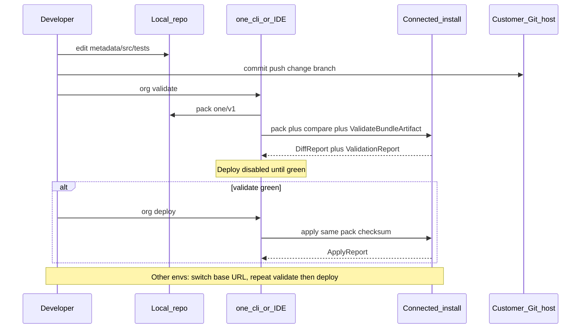

# Customer DX — validate / deploy local against org

**Status:** Implemented (Phases 1–4)  
**Depends on:** [customer-repo-init-build-plan.md](./customer-repo-init-build-plan.md) / [BP-031](../../backlog/BP-031-customer-repo-init-sync.md)  
**Playbooks:** [agent-deploy.md](./agent-deploy.md) · [agent-control-ide.md](./agent-control-ide.md) · [agent-api-families.md](./agent-api-families.md)  
**Workflow doc:** [customer-developer-workflow.md](../customer-developer-workflow.md)  
**Backlog:** [BP-032](../../backlog/BP-032-customer-dx-validate-deploy.md)

## Goal

Offer a repo-first customer DX loop for Majesta One customers without forking the product:

```text
customer Git (any host)  →  local one/v1
                              │
                              ├─ always: org validate (vs connected install)
                              └─ only if green: org deploy (to that same install)
```

**Source of change is always the repo** (local pack of `one/v1`). Installs are deployment targets, not promotion sources.

Install DB remains runtime SoR after apply ([ADR-012](../adr/012-customer-repo-and-control-ide.md)). Git is the reviewable source; Deploy validate/apply is the gate.

**Runtime isolation:** org validate/deploy must use the budgeted Deploy path in [customer-runtime-isolation-build-plan.md](./customer-runtime-isolation-build-plan.md) / [BP-033](../../backlog/BP-033-customer-runtime-isolation.md) so DX loops cannot starve live Client traffic.

## Locked decisions

| Decision | Choice |
|---|---|
| Validate first | **Always.** No deploy without a successful org validate for the same pack checksum. Phase 1 ships **validate only** (no deploy CTA yet). |
| Validate semantics | Pack local tree → **diff** vs install snapshot + `ValidateBundleArtifact` (check-only / conflict gates). Does not mutate the org. |
| Deploy source | **Repo only** — pack from local (or CI checkout) and apply to the **connected** install. |
| Peer-to-peer promote | **Out of the DX model.** Do **not** move bundles install→install. Multi-env = switch connected org (test → staging → prod) and **validate + deploy from the same Git revision** again. |
| Surfaces | **Control IDE Ship + org-aware `one` CLI** |
| Git hosting | **Provider-agnostic HTTPS remote** — GitHub, GitLab, Bitbucket, CodeCommit, etc. |

## Problem today

| Capability | Reality |
|---|---|
| Pack HEAD → validate → tests → apply | Replaced by validate-local + Deploy to org (peer push removed) |
| Offline `one validate` | Format parse only — **not** against an install |
| Local ↔ org **metadata diff** | Missing |
| Hard “validate before deploy” gate | Missing |
| Modern multi-env | Still framed as peer-to-peer bundle promote ([multi-env-deploy.md](../multi-env-deploy.md)) |

## Target multi-env model (repo → org, repeated)

```text
                    ┌── test install    ← validate + deploy from commit SHA
customer Git (main / change/*)
                    ├── staging install ← validate + deploy from same SHA
                    └── prod install    ← validate + deploy from same SHA
```

CI or a human connects credentials for each target install. There is no “push this bundle from test’s Deploy API to prod’s Deploy API” in the recommended path.

Legacy `POST /deploy/v1/bundles/{id}/push` has been **removed**. Multi-env = switch connected org and **validate + deploy from the same Git revision** again.
## Target experience (industry analogues)

| Industry DX | Majesta One DX |
|---|---|
| `project deploy validate` (industry CLI) | `one org validate` / Ship **Validate vs org** |
| `project deploy start` (industry CLI) | `one org deploy` / Ship **Deploy to org** — **only after** green validate for this HEAD |
| Connected org | Active IDE env / CLI `--base-url` + JWT |
| Promote across sandboxes | Re-point at the next org; validate + deploy from Git again |
| Any Git remote | Customer-owned GitHub/GitLab/Bitbucket/CodeCommit |

## Architecture



### Diff report (new)

Compare packed local `BundleArtifact` to install customer snapshot (+ tests):

| Kind | Meaning |
|---|---|
| `add` | In local, not on install |
| `change` | Same API key, different payload |
| `remove` | On install (customer-owned), missing from local — **warn** in v1 (no delete-by-absence) |
| `baseline` | Managed baseline drift — informational only |

### Deploy gate (invariant)

- **Validate only first, always** — deploy APIs/CLIs/IDE must refuse unless a validate result for the **same artifact checksum** is green in-session (or returned by a combined `validate-local` that deploy reuses).
- CLI: `org deploy` runs validate first by default; `--skip-validate` is an explicit escape hatch for break-glass only (document as discouraged).
- Apply path: existing `ApplyBundleArtifact` / local promotion-on-this-install via `{ bundleId }` only.

### Git host agnosticism

| Host | Auth |
|---|---|
| GitHub | HTTPS + PAT |
| GitLab | HTTPS + PAT |
| Bitbucket | HTTPS + app password |
| CodeCommit | HTTPS git credentials (SigV4 remainder BP-031) |

No Majesta One GitHub App required for v1. Customer CI calls `org validate` (and later `org deploy`) per target install URL.

## Phased delivery

### Phase 1 — Org validate only (no deploy UX)

Ship the safe half of DX first:

1. `internal/deploy/compare.go` — artifact vs snapshot diff.
2. `POST /deploy/v1/packages/validate-local` — upload zip (or `bundleId`) → `{ checksum, diff, validation }` (pack + compare + `ValidateBundleArtifact`).
3. `one org validate -dir … --base-url --token|--api-key` — exit non-zero on validation **errors**.
4. Control IDE Ship: primary CTA **Validate vs org** (diff + issues). **No Deploy button in this phase** (or Deploy visible but permanently disabled with “validate-only wave”).
5. Docs: workflow teaches validate against test; peer promote removed from golden path.
6. Tests: unit diffs; HTTP harness.

### Phase 2 — Org deploy (still validate-first; still no peer DX)

1. `one org deploy -dir …` — **always validate first** (same checksum) → optional `--suite` → apply on connected install.
2. IDE: **Deploy to org** enabled only when last validate for current HEAD checksum is green.
3. Ship **Deploy to org** enabled only when last validate for current HEAD checksum is green (no peer promote).
4. Session stores `{ headSha or treeChecksum, bundleId, validateOk }` so Deploy cannot race dirty edits.

### Phase 3 — Retrieve / refresh from org

1. `one org retrieve -dir …` — export → unpack; refuse dirty tree.
2. IDE Repo: **Refresh from org**.
3. Clarify retrieve (install → local) vs `git pull` (remote Git → local).

### Phase 4 — CI samples + peer-path deprecation notes

1. Sample GitHub Actions / GitLab CI: `org validate` on PR (test URL); `org deploy` on merge/tag per env.
2. ADR-012 / [multi-env-deploy.md](../multi-env-deploy.md) amendment: recommended path is repo→org; **peer push and inbound artifact promote removed**.
3. Production no longer requires `DEPLOY_SHARE_SECRET` / `DEPLOY_PEER_MODE=allowlist` for promote trust.

## Control IDE (in scope)

| Surface | Phase 1 | Phase 2+ |
|---|---|---|
| Ship | **Validate vs org** only | + **Deploy to org** (gated) |
| Repo | Sync local (Git) | + Refresh from org |
| Peer promote / push | Hidden or Deprecated label | Not part of DX |

## Explicit non-goals (this plan)

- Peer-to-peer / install-to-install bundle promote as the supported multi-env path
- Making Git the apply SoR (validate/apply still required)
- Deploy without prior org validate (except documented break-glass)
- Destructive delete-by-absence in v1
- Legacy metadata manifest / `package.xml` parity
- OS `git` in product images
- Multi-org fan-out in one CLI invocation (one connected org per command)

## Success criteria

- Phase 1: from a clean local clone, **Validate vs org** against test returns diff + validation; no deploy path required yet.
- Phase 2: **Deploy to org** applies only after green validate for that checksum; switching env and repeating from the same Git revision is the multi-env story.
- Docs and IDE no longer prescribe peer-to-peer promote for day-to-day DX.
- CLI works against GitHub/GitLab/Bitbucket-hosted customer repos without Electron.
