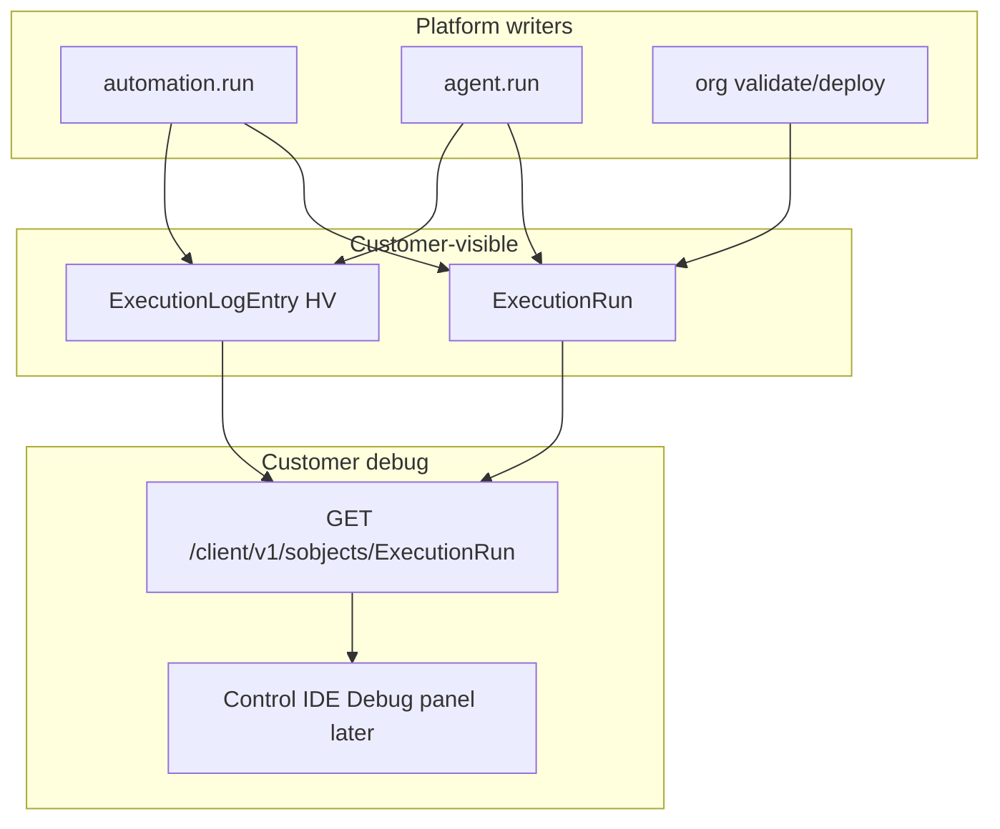

# Customer runtime isolation & debug — build plan

**Active plan** for protecting a live Majesta One install while customers validate/deploy, run automations/agents, and debug their own code — without incumbent-platform ceilings as the product limit.

**Playbooks:** [agent-worker.md](./agent-worker.md) · [agent-api-families.md](./agent-api-families.md) · [agent-data-architecture.md](./agent-data-architecture.md) · [agent-deploy.md](./agent-deploy.md) · [agent-authz.md](./agent-authz.md)  
**Domain agents:** `worker-jobs` (quotas, job classes, Deno caps); `api-families` (admission + Client debug routes); `db-backend-perf` (ExecutionRun / ExecutionLogEntry + HV); `deploy-ops` (async org validate/deploy); `authz-security` (debug.read capability).  
**Backlog:** [BP-033](../../backlog/BP-033-customer-runtime-isolation.md) · related [BP-005](./agent-worker.md) · [BP-008](../../backlog/BP-008-production-packaging.md) · [BP-009](../../backlog/BP-009-no-in-kernel-language.md) · [BP-006](../../backlog/BP-006-agent-guardrails.md) · [BP-032](../../backlog/BP-032-customer-dx-validate-deploy.md) (DX UX only — not resource isolation)

---

## Thesis

> One install stays **operational for business traffic** while Build/Ship/**repo→org** validate/deploy and customer code (automations, agents) run. Majesta One enforces **admission control + execution budgets** that are stricter than “unlimited” but **higher and more elastic than typical incumbent platform** defaults. Customers debug their own failures via **two managed objects** (`ExecutionRun`, `ExecutionLogEntry`) the platform writes; OTEL ([BP-008](../../backlog/BP-008-production-packaging.md)) remains the **operator** plane.

```text
Client / live CRM traffic  ──► API (high priority lane)
Org validate / org deploy ──► admission queue → worker jobs (budgeted)
Automation / agent runs    ──► worker job classes + per-run + install quotas
                               └── writes ExecutionRun + ExecutionLogEntry (HV)
```

---

## Product decisions (locked)

| Decision | Choice | Rationale |
|---|---|---|
| Isolation unit | **Install** (ADR-001) — not multi-tenant SaaS fair-share | One customer DB; scale = App Platform / Helm replicas + quota knobs |
| Live vs Build traffic | **Family + job-class admission** on API and worker | Validate/deploy must not starve `/client/v1` |
| Expensive Deploy work | **Async by default** (`deploy.validate`, `deploy.apply` / org deploy, `customer.test.run`) with sync only for tiny packs under a size gate | Today org validate/apply can run sync on the API process; **no** peer/inbound promote ([multi-env-deploy.md](../multi-env-deploy.md)) |
| Automation runaway | Wall time + depth + mutation caps (shipped) **plus** install concurrent slots, daily run budget, Deno RSS/CPU soft limits, per-run log byte cap | Beat incumbent heap/CPU ceilings without unbounded Deno |
| Agent runaway | Same job-class budgets + tool-call / token budget when hosted loop lands (BP-006 / BP-014) | External MCP still AuthZ-bound; hosted loop needs explicit budgets |
| Customer debug SoT | Managed objects **`ExecutionRun`** + **`ExecutionLogEntry`** (`storage_mode=high_volume`) | Queryable like CRM data; HV for append-heavy lines ([ADR-013](../adr/013-high-volume-flexible-storage.md)) |
| Operator telemetry | Keep `audit_log` + slog; OTEL = BP-008 | Do not overload `audit_log` as a developer log |
| Internal queues | Keep `jobs` / `agent_runs` / `customer_test_runs` as **platform machinery** | Project summaries into `ExecutionRun` for customer UX |
| Scale vs incumbent platforms | Document **default budgets above legacy defaults** (table below); raise via install env / Deploy exposure — not by removing caps | Customers who pay for larger App Platform/Helm get higher knobs |

### Default budgets (v1 targets — env-overridable)

| Budget | Default | Incumbent reference | Notes |
|---|---|---|---|
| Client API share of rate limit | ≥70% of `RATE_LIMIT_PER_MINUTE` | N/A (shared org limits) | Deploy/Metadata share the rest |
| Concurrent `automation.run` | `min(4, worker_replicas*2)` | Varies by platform | Hard semaphore in worker |
| Concurrent `agent.run` | `min(2, worker_replicas)` | — | Separate class so agents cannot crowd automations |
| Concurrent org validate/deploy/test | `1` per install (queue others) | One active deploy typical | Protects live DB; repo→org only |
| Async automation wall time | **120s** (raise from today’s 30s async default as opt-in; keep 30s default until Phase 2) | ~60s CPU typical async limit | Wall clock ≠ CPU; Deno still sandboxed |
| Sync automation wall time | **5s** (keep) | ~10s CPU typical sync limit | Stay strict on request path |
| Sync mutation count / depth | **50 / 3** (keep) | Platform governor mix | Already in Go |
| Per-run log capture | **256 KiB** truncated | Typical debug log sizes | Excess → `truncated=true` on run |
| Daily automation executions | **1_000_000** / install default | ~250k async/day edition-dependent | Soft quota → 429/job fail with clear code |
| Daily agent runs | **50_000** / install default | — | Raise with install size |
| Deno memory soft limit | **512 MiB** RSS | 6–12 MiB heap typical | Still far above legacy defaults; cgroup when container supports |

---

## Data model (two objects)

Managed module **`platform_debug`** (clone-on-enable or always-on seed — prefer **always seeded** like `core` audit surfaces so debug works day one).

### 1. `ExecutionRun` (`storage_mode=flexible`)

One row per platform-executed unit of customer work.

| Field | Type | Purpose |
|---|---|---|
| `Kind` | picklist | `automation` \| `agent` \| `deploy_validate` \| `deploy_apply` \| `customer_test` \| `mcp_tool` (optional) |
| `Status` | picklist | `queued` \| `running` \| `succeeded` \| `failed` \| `cancelled` \| `throttled` |
| `SubjectApiName` | string | Automation / AgentSpec / package name |
| `ActorId` | lookup User | Run-as / requester |
| `JobId` | string | Internal `jobs.id` when applicable |
| `StartedAt` / `CompletedAt` | datetime | Duration |
| `ErrorCode` / `ErrorMessage` | string | Exception summary (customer-visible) |
| `Stats` | json | `{ durationMs, logBytes, toolCalls, mutationCount, truncated }` |
| `CorrelationId` | string | Request-id / MCP id |

**AuthZ:** read via Client for principals with system capability **`debug.read`** (Admin + optional Developer PS). Writers = platform only (`managed` ownership; customer cannot invent fake runs).

### 2. `ExecutionLogEntry` (`storage_mode=high_volume`)

Append-only lines / structured events for a run.

| Field | Type | Purpose |
|---|---|---|
| `ExecutionRunId` | lookup ExecutionRun (indexed) | Parent |
| `Seq` | number | Order within run |
| `Level` | picklist | `debug` \| `info` \| `warn` \| `error` |
| `Message` | string | Line text |
| `Data` | json | Optional structured payload (stack, SDK call) |
| `CreatedAt` | datetime | HV range key |

**Retention:** default **14 days** hot partitions; worker purge/DETACH older (product job). Cap lines per run from `Stats.logBytes`.

**SDK:** guest `ctx.log.info/warn/error(...)` → host writes `ExecutionLogEntry` (counts against per-run cap). Uncaught exceptions → `ExecutionRun` failed + final error entries.



---

## Phases

### Phase 0 — Spec lock & knobs surface

**Agents:** `worker-jobs`, `api-families`  
**Status:** Done when this plan + BP-033 land.

1. Document budgets in [tech-stack.md](../tech-stack.md) / [security.md](../security.md) env table.
2. Config keys (names locked):

| Env | Default | Meaning |
|---|---|---|
| `ADMISSION_CLIENT_RPM_SHARE` | `0.7` | Fraction of global RPM reserved for Client |
| `JOB_SLOTS_AUTOMATION` | `4` | Concurrent automation.run |
| `JOB_SLOTS_AGENT` | `2` | Concurrent agent.run |
| `JOB_SLOTS_DEPLOY` | `1` | Concurrent org validate/deploy/test |
| `QUOTA_AUTOMATION_RUNS_PER_DAY` | `1000000` | Soft daily cap |
| `QUOTA_AGENT_RUNS_PER_DAY` | `50000` | Soft daily cap |
| `EXECUTION_LOG_BYTES_PER_RUN` | `262144` | Capture cap |
| `EXECUTION_LOG_RETENTION_DAYS` | `14` | HV purge |
| `DENO_RSS_LIMIT_MB` | `512` | Soft limit when enforceable |

### Phase 1 — Admission control (live vs Build)

**Agents:** `api-families`, `deploy-ops`  
**Packages:** `internal/httpapi`, `internal/config`, `internal/deploy`  
**Status:** Done (lanes + size-gated 202 / `DEPLOY_BUSY` + worker `deploy.*`; CLI/MCP poll). `jobs.class` slot enforcement is Phase 2.

1. Split rate limiter into **lanes**: `client` | `metadata` | `deploy` | `auth` (auth already separate).
2. Org validate / org deploy (apply) / test-run endpoints: if estimated cost above threshold (bundle size, suite count), **enqueue** job and return `202` + `ExecutionRun` id (or job id until objects exist).
3. Reject additional Deploy mutates with `429` / `DEPLOY_BUSY` when `JOB_SLOTS_DEPLOY` saturated (queue depth limit).
4. Never hold Client request threads waiting on full customer test suites.

**Exit:** Under load test, Client p95 stays within SLA while a full validate runs.

### Phase 2 — Worker job classes & quotas

**Agents:** `worker-jobs`  
**Packages:** `internal/worker`, `internal/automation`, `internal/config`

1. Tag jobs with `class` (`automation` | `agent` | `deploy` | `default`); claim loops respect per-class slots.
2. Daily counters in Postgres (`install_quota_counters` kernel table — date, class, count) with atomic increment; exceed → fail job with `QUOTA_EXCEEDED` and `ExecutionRun.status=throttled`.
3. Deno: apply RSS limit via OS (`ulimit`/cgroup) when available; always enforce wall timeouts; stream guest logs into capture buffer.
4. Agent stub path: still create `ExecutionRun`; now that the BP-006 hosted loop exists, count tool calls against `Stats.toolCalls` + budget.

**Exit:** A runaway automation loop hits concurrent + daily caps without exhausting API pool connections.

### Phase 3 — Debug objects (`ExecutionRun` / `ExecutionLogEntry`)

**Agents:** `db-backend-perf`, `api-families`, `authz-security`  
**Packages:** `internal/seed`, `internal/packages`, `migrations/` (if kernel counters), `internal/dataengine`, `internal/automation`, `internal/worker`

1. Seed managed objects + fields; `ExecutionLogEntry` → `high_volume`.
2. Capability `debug.read` on Admin + new optional PS `DebugViewer`.
3. Wire writers: automation (sync + async), agent.run, org validate/deploy, customer tests.
4. Guest SDK `ctx.log.*` + exception bridge.
5. Client query works with HV time/run-id predicates; reject unbounded full-table scans (ADR-013).
6. Retention worker job `execution_log.purge`.

**Exit:** Customer can reproduce a failing automation, open `ExecutionRun`, page `ExecutionLogEntry` lines, see exception text — without SSH or operator logs.

### Phase 4 — Developer UX (thin)

**Agents:** `control-ide` (optional follow-on), docs only in this BP if IDE slips  
**Packages:** `tools/control-ide` **or** docs-only first

1. Control IDE Build/Ship: link to latest `ExecutionRun` after validate/deploy/automation Run.
2. Docs: [customer-developer-workflow.md](../customer-developer-workflow.md) + this plan’s debug recipe.
3. Operate **Monitor** (user TraceFlag + crash-safe log tail) is specified separately in [ADR-030](../adr/030-install-agent-runtime.md) / [BP-034](../adr/030-install-agent-runtime.md) — consumes Phase 3 objects; does **not** block Phase 1–3.
4. Do **not** block Phase 1–3 on IDE chrome.

### Phase 5 — Elastic scale story

**Agents:** `deploy-ops`  
**Packages:** `docs/`, optional Deploy exposure fields

1. Document how raising App Platform instance count / worker replicas interacts with slot defaults (`min(N, replicas*k)`).
2. Optional Metadata/Deploy exposure knobs for quotas (admin-only) — still install-local, not multi-tenant SaaS metering.
3. Pair with BP-008 OTEL metrics: queue depth, throttle count, Deno OOM.

---

## Non-goals

- Multi-tenant fair-share across customers (ADR-001)
- Unlimited Deno / npm / network in guest (ADR-014)
- Replacing OTEL with ExecutionLogEntry for operators (BP-008 stays)
- Using `audit_log` as the developer debug stream
- Legacy vendor-compatible debug log file format
- Guaranteeing sync Deploy for multi-thousand-file packs
- Reintroducing peer/inbound promote (repo→org only; [multi-env-deploy.md](../multi-env-deploy.md))

---

## Relationship to BP-032 (Customer DX)

[BP-032](../../backlog/BP-032-customer-dx-validate-deploy.md) is **workflow UX** (local tree ↔ org validate/deploy). This plan is **runtime protection + debug SoT**. DX validate/deploy must call the same budgeted **repo→org** Deploy path from Phase 1 so “Validate vs org” / “Deploy to org” cannot melt a production install. Peer/inbound promote is out of scope (removed).

---

## Implementation order

```text
Phase 0 (docs/BP) 
  → Phase 1 admission + async Deploy   (api-families, deploy-ops)
  → Phase 2 job classes + quotas       (worker-jobs)
  → Phase 3 ExecutionRun/LogEntry      (db-backend-perf, authz-security)
  → Phase 4 IDE/docs UX                (control-ide optional)
  → Phase 5 elastic knobs + OTEL hooks (deploy-ops, BP-008)
```

---

## Success criteria

1. A full package org validate/deploy cannot monopolize API workers or the DB pool while Client CRUD continues.
2. A buggy automation or agent hits explicit throttle/quota errors instead of install-wide brownout; ceilings remain **above** typical incumbent platform governor defaults.
3. Customers debug their code via `ExecutionRun` + `ExecutionLogEntry` over Client API (and later IDE) without operator log access.
4. BP-033 status tracks phase exits; BP-008 remains the operator OTEL track.

## Related

- [ADR-001](../adr/001-dedicated-install.md) · [ADR-013](../adr/013-high-volume-flexible-storage.md) · [ADR-014](../adr/014-customer-code-automations.md) · [ADR-010](../adr/010-customer-agentic-platform.md)
- [customer-automations-build.md](./customer-automations-build.md)
- [customer-dx-build-plan.md](./customer-dx-build-plan.md)
- [customer-connect.md](../customer-connect.md)
- [module-map.md](./module-map.md)
