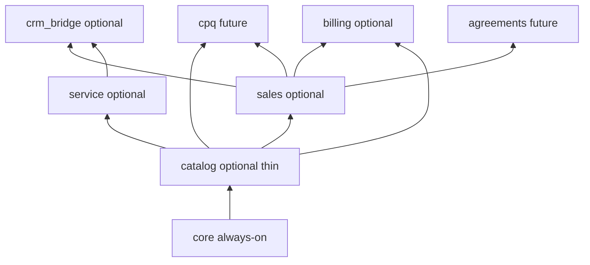
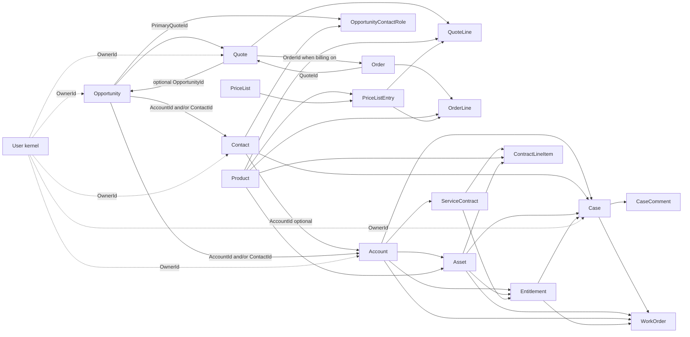

# Sales & Service data model

Canonical architecture for optional managed **Sales** and **Service** modules on Majesta One’s User / Account / Contact core. Decision record: [ADR-011](../adr/011-sales-service-managed-modules.md). Module contracts: [modules/README.md](../modules/README.md).

This document is the relationship spine and open-schema contract. Optional modules are registered in `internal/seed`; enabling them never requires customer Postgres DDL ([ADR-002](../adr/002-hybrid-metadata-storage.md)).

## Principles

1. **Core stays thin** — User (kernel), Account, Contact only ([ADR-008](../adr/008-core-data-model.md)).
2. **Optional modules are interoperable** — a customer may enable `catalog`, `sales`, `service`, and `crm_bridge` together (and later `cpq` / `billing` / `agreements`) without object/apiName collisions.
3. **Thin catalog, fat CPQ later** — Product + PriceList + PriceListEntry are shared sellable identity; configuration/pricing engines stay out of `catalog`.
4. **QuoteLine is commercial SoT** — no Lead; no OpportunityLineItem; Order lives in optional `billing` ([ADR-031](../adr/031-billing-managed-module.md)); sales Contract deferred.
5. **Relationship-first** — essential lifecycle fields only; omit Actions, Campaigns, Files, Emails, Knowledge, EntitlementProcess. (Conversation **Messages** are the separate optional `messages` module — [messages.md](../modules/messages.md) — not part of Sales/Service clouds.)

## Package DAG



| Package | Depends on | Objects / artifacts | Docs |
|---|---|---|---|
| `core` | — | User, Account, Contact | [core.md](../modules/core.md) |
| `catalog` | `core` | Product, PriceList, PriceListEntry | [catalog.md](../modules/catalog.md) |
| `sales` | `core`, `catalog` | Opportunity, OpportunityContactRole, Quote, QuoteLine | [sales.md](../modules/sales.md) |
| `service` | `core`, `catalog` | Case, CaseComment, Asset, Entitlement, ServiceContract, ContractLineItem, WorkOrder | [service.md](../modules/service.md) |
| `crm_bridge` | `sales`, `service` | `Case.OpportunityId` (fields only); **AutoEnable** | [crm-bridge.md](../modules/crm-bridge.md) |
| `cpq` | `catalog`, `sales` | Options/Features/Rules; extends QuoteLine | Future ADR |
| `billing` | `catalog`, `sales` | Order, OrderLine (+ Invoice later) | [billing.md](../modules/billing.md) · [ADR-031](../adr/031-billing-managed-module.md) |
| `agreements` | `core` (+ optional sales) | Sales Contract / Agreement | Future ADR |

### Why this split

- **`catalog` separate from `sales`** — Service Assets and ServiceContract lines need Product without enabling Sales; Sales needs list prices without enabling Service.
- **`crm_bridge`** — Metadata lookup sync requires the target object to exist (`requireObject`). Cross-cloud FKs cannot live in `service` alone when Opportunity is absent. Marked **AutoEnable**: enabled automatically when both parent clouds are on so admins never hunt for bridge packages.
- **Future `cpq`** depends on catalog + sales, never the reverse — simple selling works without CPQ.

## Relationship spine



### Composition vs lookup

| Kind | Objects |
|---|---|
| **Composition** (master_detail / cascade) | QuoteLine→Quote, OrderLine→Order, PriceListEntry→PriceList, CaseComment→Case, ContractLineItem→ServiceContract |
| **Lookup** (ownable peers) | Opportunity, Quote, Order, Case, Asset, Entitlement, ServiceContract, WorkOrder → Account and/or Contact; lines/assets → Product |

### Ownership

Ownable peers expose optional `OwnerId` → User (kernel). Composition children (lines, comments, price list entries) do not rely on independent ownership. System audit columns (`CreatedById`, `LastModifiedById`, timestamps) apply to all flexible records ([ADR-009](../adr/009-record-audit-authz-packaging.md)).

## Thin catalog (CPQ-ready, not CPQ)

Enterprise CPQ platforms layer configuration and pricing engines on a simple sellable catalog. Majesta One keeps those layers separate:

| In `catalog` (shared) | Deferred to future `cpq` |
|---|---|
| Product (SKU identity) | ProductOption / Feature / Bundle graph |
| PriceList + PriceListEntry (list price index) | Config attributes, product/price rules |
| Consumed by Sales, Service, future Billing | Discount schedules, tier/usage matrices, guided selling, calculator state |

**List price is not the pricing engine.** `PriceListEntry` holds catalog list amount only. `QuoteLine` stores frozen commercial amounts plus:

`PriceSource` ∈ `PriceList | Manual | Contract | CpqRule | External`

### Future `cpq` attachment (no PG migration)

```text
cpq depends_on: [catalog, sales]
  → new managed objects (ProductFeature, ProductOption, ConfigAttribute,
     ProductRule, PriceRule, DiscountSchedule, …)
  → additive managed fields on Product / QuoteLine
       (e.g. BundleParentLineId, ConfiguredProductId, calculator fields)
  → Sync*Managed only; package_installs version bump
```

- Sales **without** `cpq`: pick Product, copy list price onto QuoteLine (`PriceSource=PriceList` or `Manual`).
- Sales **with** `cpq`: same QuoteLine shape; richer child lines and `PriceSource=CpqRule`.
- Service / Billing never require CPQ objects — only `ProductId` + frozen amounts.

## No Lead

Managed Sales omits **Lead**. Reasons:

- Account + Contact already cover party identity; Lead duplicates it and implies an undesigned convert pipeline.
- Customers may add a customer-owned pre-qualification object or use early Opportunity stages.
- Legacy Lead was purged by migration `0012`; convert is platform action `lead.convert` on `lead_marketing` ([ADR-029](../adr/029-platform-actions.md)).

Pipeline entry = **Opportunity** with Account and/or Contact (≥1).

## Quote / Order / Contract rationale

Classic CRM platforms ship Quote, Order, and Contract plus three editable line masters. That produces twin-field sync and forecast-vs-quote drift.

| Object | True job | Majesta One staging |
|---|---|---|
| Opportunity | Pipeline hypothesis (stage, owner, amount) | **`sales` v1** |
| Quote | Customer-facing commercial offer | **`sales` v1** (first-class) |
| QuoteLine | Offered products and prices (SoT) | **`sales` v1** |
| OpportunityLineItem | Second line master | **Omitted** |
| Order / OrderItem | Accepted commitment / fulfillment | **`billing` v1** (immutable snapshot from accepted QuoteLine) |
| Sales Contract | Termed legal/commercial agreement | Future **`agreements`** |
| ServiceContract | Support entitlement agreement | **`service`** (not sales CLM) |

### Quote improvements

1. First-class document: AccountId and/or ContactId required; **optional** OpportunityId (standalone quotes allowed); optional PriceListId.
2. `Opportunity.PrimaryQuoteId` documents which Quote drives the deal.
3. QuoteLine fields sized for simple Sales and future CPQ: ProductId, optional PriceListEntryId, Quantity, ListPrice, UnitPrice, DiscountPercent, Amount, PriceSource.
4. Opportunity.Amount is manual or later primary-Quote rollup — not backed by a second line table in v1.

## Object field contracts (essential)

### `catalog`

| Object | Essential fields |
|---|---|
| Product | Name (req), ProductCode (indexed), IsActive, Family (optional), ProductType (Good / Service / Subscription, informational) |
| PriceList | Name (req), IsActive, IsStandard, CurrencyCode (optional) |
| PriceListEntry | ProductId (req), PriceListId (req), ListPrice (currency, req), IsActive |

### `sales`

| Object | Essential fields | Relationships |
|---|---|---|
| Opportunity | Name, StageName, CloseDate, Amount, IsClosed, IsWon, OwnerId, PrimaryQuoteId (optional) | AccountId **and/or** ContactId (≥1); children OCR, Quotes |
| OpportunityContactRole | OpportunityId, ContactId, Role, IsPrimary | M:N junction |
| Quote | Name, Status, ExpirationDate, OwnerId, PriceListId (optional); CurrencyCode, TaxAmount, ShippingAmount, AcceptedAt; Billing/Shipping address scalars | AccountId **and/or** ContactId; optional OpportunityId; children QuoteLine; OrderId when `billing` enabled |
| QuoteLine | QuoteId (MD), ProductId (req), Quantity, ListPrice, UnitPrice, DiscountPercent, Amount, PriceSource, PriceListEntryId (optional), UnitId (optional) | Commercial SoT |

### `service`

| Object | Essential fields | Relationships |
|---|---|---|
| Case | Subject, Status, Origin, Priority, OwnerId | AccountId and/or ContactId; optional AssetId, EntitlementId, ParentId |
| CaseComment | ParentId (MD→Case), Body, IsPublished | Parent-controlled |
| Asset | Name, Status, AccountId, ProductId | Optional ContactId |
| Entitlement | Name, AccountId, StartDate, EndDate, Status | Optional AssetId, ServiceContractId |
| ServiceContract | Name, AccountId, Status, StartDate, EndDate | Children ContractLineItem + Entitlements |
| ContractLineItem | ServiceContractId (MD), ProductId and/or AssetId | |
| WorkOrder | Status, Subject, OwnerId | AccountId and/or CaseId and/or AssetId; optional EntitlementId, ServiceContractId |

### `crm_bridge`

| Field | On | References |
|---|---|---|
| OpportunityId | Case | Opportunity |

### `billing`

| Object | Essential fields | Relationships |
|---|---|---|
| Order | Name, OrderNumber (autonumber), Status, OwnerId; CurrencyCode; Subtotal, TaxAmount, ShippingAmount, TotalAmount; Billing/Shipping scalars; EffectiveDate, ActivatedAt | AccountId **and/or** ContactId (≥1); optional OpportunityId, QuoteId, PriceListId; children OrderLine |
| OrderLine | OrderId (MD), ProductId (req), Quantity, ListPrice, UnitPrice, DiscountPercent, Amount, PriceSource, QuoteLineId, PriceListEntryId, UnitId | Snapshot; mutable only while Order.Status=`Draft` |

## Open schema / interoperability practices

1. **Stable API names** — Prefer familiar commercial names (`Product`, `Opportunity`, `Quote`, `Case`); prefer **PriceList** over Pricebook. Package name ≠ object apiName.
2. **Semantic field types** — canonical Majesta One types only (see [ADR-017](../adr/017-canonical-field-types.md)): core `text`, `textarea`, `email`, `phone`, `url`, `picklist`, `lookup`, `master_detail`, `date`, `datetime`, `time`, `integer`, `number`, `currency`, `percent`, `boolean`; enhancements `json`, `autonumber`, `richtext`, `address`, `geolocation`. Discover via `GET /metadata/v1/field-types`. No `multipicklist` / formula / rollup / `polymorphic_lookup` in v1.
3. **Identity vs attributes** — system columns relational; business attrs in `data` JSONB ([ADR-002](../adr/002-hybrid-metadata-storage.md)).
4. **Party links** — explicit AccountId / ContactId + validation (≥1 where required); not a single polymorphic customer column ([ADR-003](../adr/003-sql-query-engine.md) join simplicity).
5. **schema.org mapping** (export/integration vocab): Organization↔Account, Person↔Contact, Product/Offer↔Product+PriceListEntry, Service↔Entitlement/ServiceContract, Order↔Order.
6. **Runtime schema** — Client `describe` / Metadata APIs; module docs are the public contract; no anonymous schema catalog.
7. **Customer extensibility** — `__c` fields/objects via Metadata + Deploy; managed sync refuses customer-owned apiName collisions.
8. **No enable-time DDL** — Metadata sync only; hot FKs via `indexed` → `field_projections`.

## Index / AuthZ defaults

- Lookup/MD fields and Name / Status / StageName / CloseDate: `indexed`, `filterable`, `sortable` where list queries need them.
- On enable: Admin permission set gains object CRUD (existing module behavior).
- Non-admin access via customer permission sets + FLS.

## Future module attachment rules

1. Depend on `core` (and `catalog` if commercial/SKU-related).
2. Look up Account / Contact / User (`OwnerId`); do not invent a parallel party model.
3. Never collide on managed `object_api_name` or field `apiName`.
4. Put cross-package optional FKs in an **AutoEnable** bridge package (or extend `crm_bridge`) so enable order stays valid under `requireObject` and customers never manually enable bridges.
5. Prefer additive managed fields forever; breaking changes need an explicit product policy ([BP-007](../adr/020-cdm-managed-packages.md)).

## Explicit non-goals

- Quote-document generation / PDF (convert is [ADR-029](../adr/029-platform-actions.md) `lead.convert`, not a `sales` route)
- Lead / Campaign inside `sales` or always-on `core` (optional `lead_marketing` per ADR-020)
- OpportunityLineItem, Order, sales Contract in `sales` v1 (Order ships in optional `billing`)
- CPQ objects inside `catalog`
- Person Accounts; EntitlementProcess; Knowledge; Files
- Party / Customer base or polymorphic `parentCustomer` ([ADR-020](../adr/020-cdm-managed-packages.md))
- Typed kernel tables for any of these objects; hard uninstall of soft-disabled modules

Attribute mapping and optional packs (`address`, `activities`, `lead_marketing`): [cdm-mapping.md](./cdm-mapping.md), [ADR-020](../adr/020-cdm-managed-packages.md).

## Related

- [ADR-011](../adr/011-sales-service-managed-modules.md)
- [ADR-029](../adr/029-platform-actions.md) — package-gated Client verbs (`lead.convert`)
- [data-model.md](../data-model.md)
- [agent-data-architecture.md](./agent-data-architecture.md)
- [modules/README.md](../modules/README.md)
- Seed: `internal/seed/module_catalog.go`, `module_sales.go`, `module_service.go`, `module_crm_bridge.go`, `module_billing.go`
- [ADR-031](../adr/031-billing-managed-module.md) — optional `billing` + `quote.accept`
- [billing-module-build-plan.md](./billing-module-build-plan.md)
