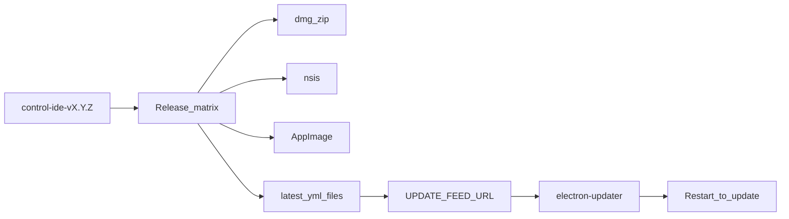

# Control IDE — visual system & continuous updates

Tech design for Majesta One Control (`tools/control-ide`). Complements [control-ide-build.md](./control-ide-build.md) (packaging/CI), [ADR-012](./adr/012-customer-repo-and-control-ide.md) (plane fence), and the agent-first UX spec [customer-ide-ux.md](./customer-ide-ux.md).

## Visual system (own tokens)

Control IDE uses **owned CSS design tokens** in `tools/control-ide/src/renderer/styles.css` — no third-party design-system npm dependency. Shared React primitives live under `tools/control-ide/src/renderer/ui/` (className-based). Icons are hand-curated SVGs in `tools/control-ide/src/renderer/icons/`.

| Principle | Choice |
|---|---|
| Look | Enterprise console + futuristic IDE (graphite / paper surfaces, cool ink, one electric accent) |
| Density | Console-grade for Build/Ship; slightly airier Operate boards |
| Typography | IBM Plex Sans / IBM Plex Serif / IBM Plex Mono (**self-hosted** under `tools/control-ide/assets/fonts/`) |
| Framework | Plain CSS variables + React classNames |
| Themes | **Dark and light** via `data-theme` on the document element |
| Motion | Check-dot pulse, stream message enter, panel fade, **Operate graph command-bar focus + node pulse** (180–220ms); honor `prefers-reduced-motion` |

### Token roles

**Surfaces / ink:** `--bg`, `--bg-glow`, `--bg-deep`, `--panel`, `--ink`, `--muted`, `--line`, `--accent`, `--accent-dim`, `--accent-ink`, `--warn`, `--danger`, `--success`, `--info`, `--nav`, `--surface-elevated`, `--stream-bg`, `--check-pass`, `--check-run`.

**Scale:** `--space-1`…`--space-6`, `--text-xs`…`--text-display`, `--radius-sm` / `--radius` / `--radius-lg`, `--elev-1` / `--elev-2`.

Do not introduce a parallel UI kit without updating [tech-stack.md](./tech-stack.md).

### Primitives (`src/renderer/ui/`)

`Button` (primary / secondary / ghost / danger + busy), `Spinner`, `Skeleton` / `BootSkeleton`, `EmptyState`, `StatusBadge` / `CheckDot`, `PanelHeader`, **`ToolSurface` / `ToolToolbar` / `SearchField`** (required tool frame — [agent-control-ide.md](./architecture/agent-control-ide.md); Operate graph exempt), `DataTable`, `KeyValueList`, `FileDrop`.

### Dual theme

| Attribute | Behavior |
|---|---|
| Selector | `html[data-theme="dark"]` / `html[data-theme="light"]` (also sets `color-scheme`) |
| Accent | Teal family retained in both themes for brand continuity |
| Dark | Graphite console (`#0b0f14` bg, cool ink) — default for technical audiences |
| Light | Cool paper surfaces + graphite ink — business-friendly, not consumer pastel |
| Persistence | `localStorage` key `one.control.theme` (`dark` \| `light`) |
| First launch | `window.matchMedia("(prefers-color-scheme: light)")` when no stored preference |
| Toggle | Top-bar icon control + `Ctrl/Cmd+Shift+L` |
| Monaco | `vs-dark` when dark, `vs` when light |

### Chrome principles (Customer IDE)

| Region | Role |
|---|---|
| Top bar | Brand, **centered mode title** (hover/click → launcher overlay), Env switcher, theme icon, account chip (initials + name). **Do not** put Operate search here — it shifts title and actions ([ADR-028](./adr/028-operate-graph-surface.md)) |
| Operate graph | Command bar at the top of the graph tile (`⌘K`); results drop from the bar; matching nodes pulse |
| Workspace | Full-bleed **2-slice** board — 1 fills / 2 resize (one tool + one agent; select swaps). Empty board docks both catalogs; they retract to 44px hover strips once a tool or agent is selected. Hover open/close overlays inside those columns and must **not** change `grid-template-columns`. |
| Tool rail | Left 44px strip; hover overlay and pin share a 240px catalog (284px docked column). Pin does not restyle the strip. Overlay closes on select. |
| Agent stream | Right rail with the same 44/240/284 geometry; mode-filtered agents; **click** to open a 1:1 chat |
| Status bar | Compact single-row Draft / checks chips — fixed height across all modes |

Stream message roles: human, agent, system, tool, approval — **quiet** differentiation (alignment + thin accent), not five competing bubble fills. Type scale in chat must use `--text-xs` / `--text-sm` / `--text-md` only (see [customer-ide-ux.md](./customer-ide-ux.md) Phase V).

## Continuous updates

Desktop apps ship continuous updates the same way typical desktop auto-update channels do: **not** via App Store — via `electron-updater` against a version feed.

| Piece | Behavior |
|---|---|
| Feed | Generic HTTP(S) provider (`latest.yml` / `latest-mac.yml` / `latest-linux.yml`) |
| Gate | Updates run only when the app is packaged **and** `UPDATE_FEED_URL` is set |
| UI | Compact top-bar icon + popover: disabled message, check, download, restart-to-install |
| Targets | mac zip (+ dmg), Windows NSIS, Linux AppImage — already in `electron-builder.yml` |

### Frozen (ADR-030)

Private update CDN (S3 + CloudFront or equivalent), signed Mac/Windows publish, customer download portal, distribution E2E, and a local/file-based CI update-feed smoke are **frozen**. See [ADR-030](./adr/030-install-agent-runtime.md).

The in-tree scaffold may exist; live feed verification remains blocked until an AWS (or equivalent) account and signing secrets are available.

## Plane fence

Unchanged from ADR-012: Control IDE is vendor-plane only; AuthZ and Deploy logic stay on the Go install.

## Related

- [ADR-030](./adr/030-install-agent-runtime.md) — freeze vs finish (update CDN / chrome frozen)
- [BP-060](../backlog/BP-060-operate-graph-surface.md) — Operate graph surface (command bar, glance, drop Tools)
- [BP-066](../backlog/BP-066-ide-demo-client-fidelity.md) — honest JWT demo client
